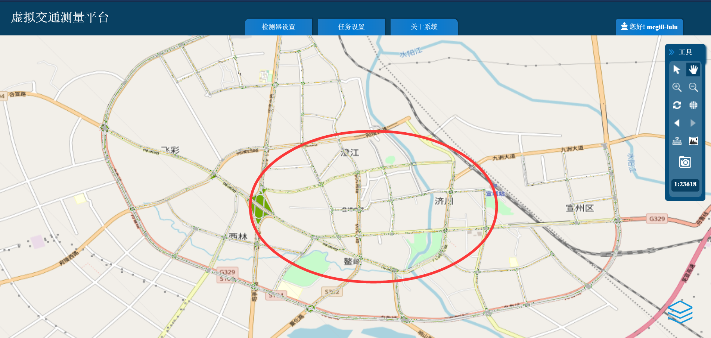

# VSensor Q&A
Repo for QA and BBS of VSensor platform in NACTrans 2020. Please login via http://vsensor.openits.cn/login.html

## 使用说明
* 处于数据安全的考虑，测量结果不开放下载到本地机器。本次大赛为参赛队伍准备了封闭的云计算环境，数据会自动下载到用户的云计算平台目录中，支持使用python语言进行数据处理与模型学习。因此在使用测量平台前，需要先前往云计算平台（`http://odap.openits.cn`）进行激活。登录账号与密码与测量平台一致。激活方法为：登录odap云计算平台后，在根目录下新建文件夹，并命名为：“measurement”.

* 用户权限：且最多设置20个线圈，每日允许检测次数为20次，每次检测时间跨度不超过12小时。浮动车渗透率设置为大于0的值即可，返回的是出租车的轨迹，检测时间跨度不超过2小时，可以与线圈同时检测，超过2小时检测时间的，按任务设置的开始时间t0为始，t0+2小时结束。

* 如有技术问题需要协助，可首先参考以下的高频Q&A问题，或者在issues里面查找。若依然无法解决，可针对您的问题新建一个issue，或者email联系：`vsensorhelpdesk@gmail.com`

## Q&A

### Q1. 数据时空范围

A1. 目前数据仅开放2019年7月的数据，超出这个时间范围的查询不到结果。建议选择中心城区作为主要研究区域，见下图：

### Q2. 卡口检测使用

A2. 卡口检测功能涉及数据隐私问题，在本次比赛中不开放使用。感谢理解。

### Q3. 线圈检测的使用

A3. 线圈是主要是检测您所选的道路断面的流量与车速，统计间隔可以自定义。垂直与道路方向设置。且正反向需要分别设置。

